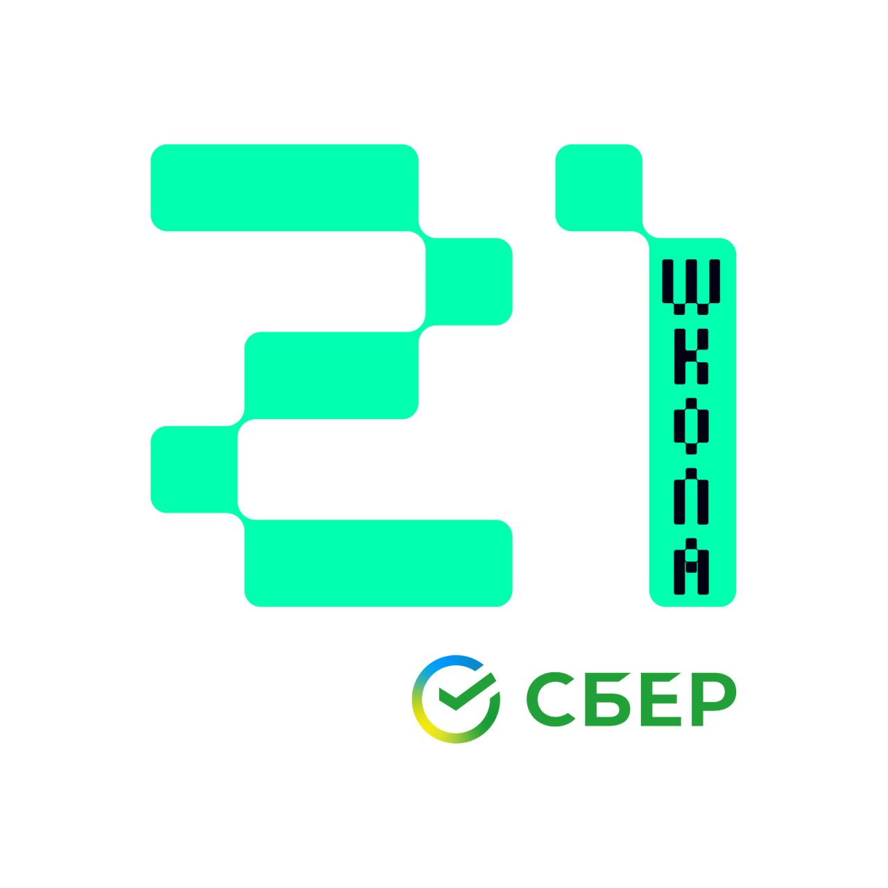

<!--
**mysticalien/mysticalien** is a ✨ _special_ ✨ repository because its `README.md` (this file) appears on your GitHub profile.

Here are some ideas to get you started:

- 🔭 I’m currently working on ...
- 🌱 I’m currently learning ...
- 👯 I’m looking to collaborate on ...
- 🤔 I’m looking for help with ...
- 💬 Ask me about ...
- 📫 How to reach me: ...
- 😄 Pronouns: ...
- ⚡ Fun fact: ...
-->
<!--
- 👾 21 school: @celiacsi
- ⚡️ tg: [@mysticalien](https://t.me/mysticalien)

-->

## Welcome to Meowgician's Code Wonderland! (⁎˃ᆺ˂)

### Connect with Me

<!--

-->

- Telegram: [@mysticalien](https://t.me/mysticalien)
- Gmail: [rjevskayao@gmail.com](mailto:rjevskayao@gmail.com)
- School21: [@celiacsi](https://edu.21-school.ru/profile/celiacsi@student.21-school.ru)

### About me

As a proud Meowgician, my goal is to weave spells with code and create purrfectly delightful programs. I'm currently enrolled in the mystical realm of School21 programming, where I'm honing my ninja skills. On the side, I enjoy cracking LeetCode challenges, sharpening my claws for the ultimate coding battles.

<!--

  

-->

### Programming Languages

I'm fluent in the following programming languages:
- Go
- Kotlin
- Python
- C
- Java

### My Projects

- [Real-Time Chat](https://github.com/mysticalien/RealTimeChat) - A simple real-time messaging application written in Golang. Users can send and receive messages without refreshing the page, thanks to WebSocket technology.
- [SimpleBash](https://github.com/mysticalien/SimpleBash) - This project is a C implementation of the cat and grep commands, two fundamental Unix utilities.
- [Tic-Tac-Toe](https://github.com/mysticalien/tic-tac-toe) - Crafting a purrfectly charming Tic-Tac-Toe game in Python.

### GitHub Stats

### Let's Conjure Some Code!

I'm always up for magical collaborations and coding adventures. If you have spells to share or just want to chat about cats and code, send a magical signal via Telegram.

(ﾉ◕ヮ◕)ﾉ*:･ﾟ✧

